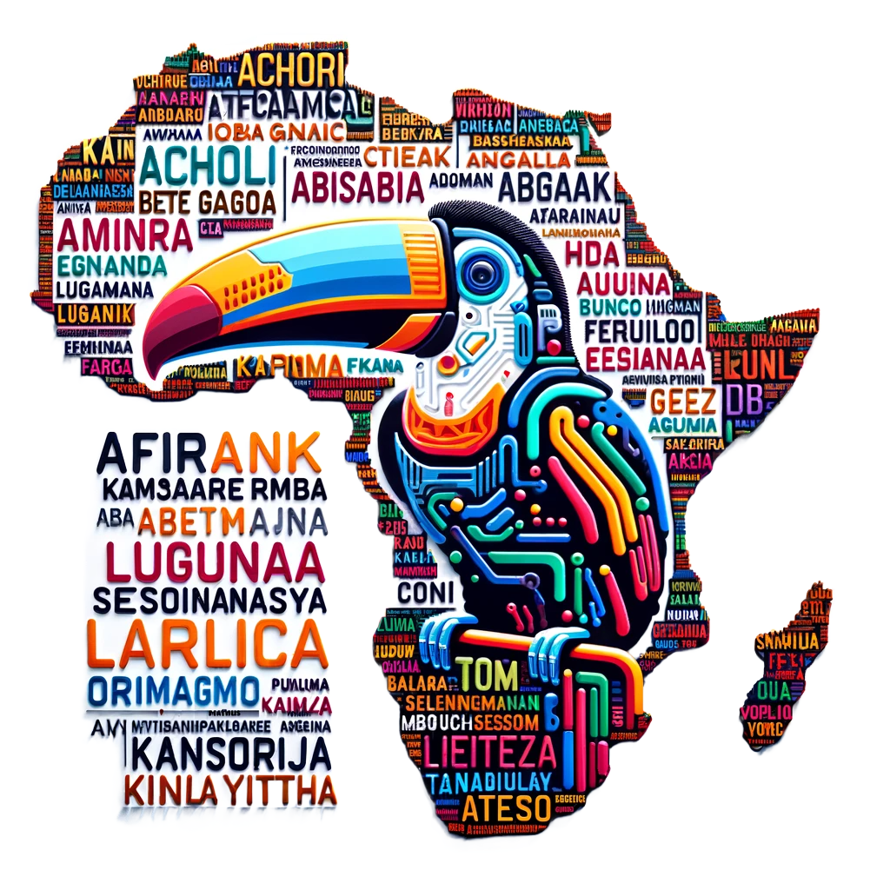
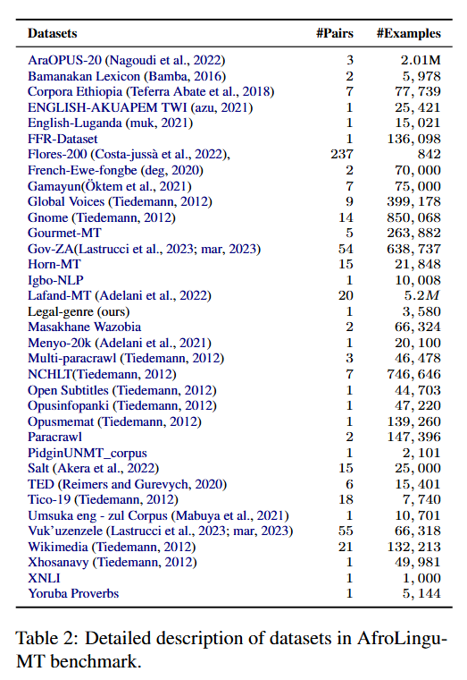
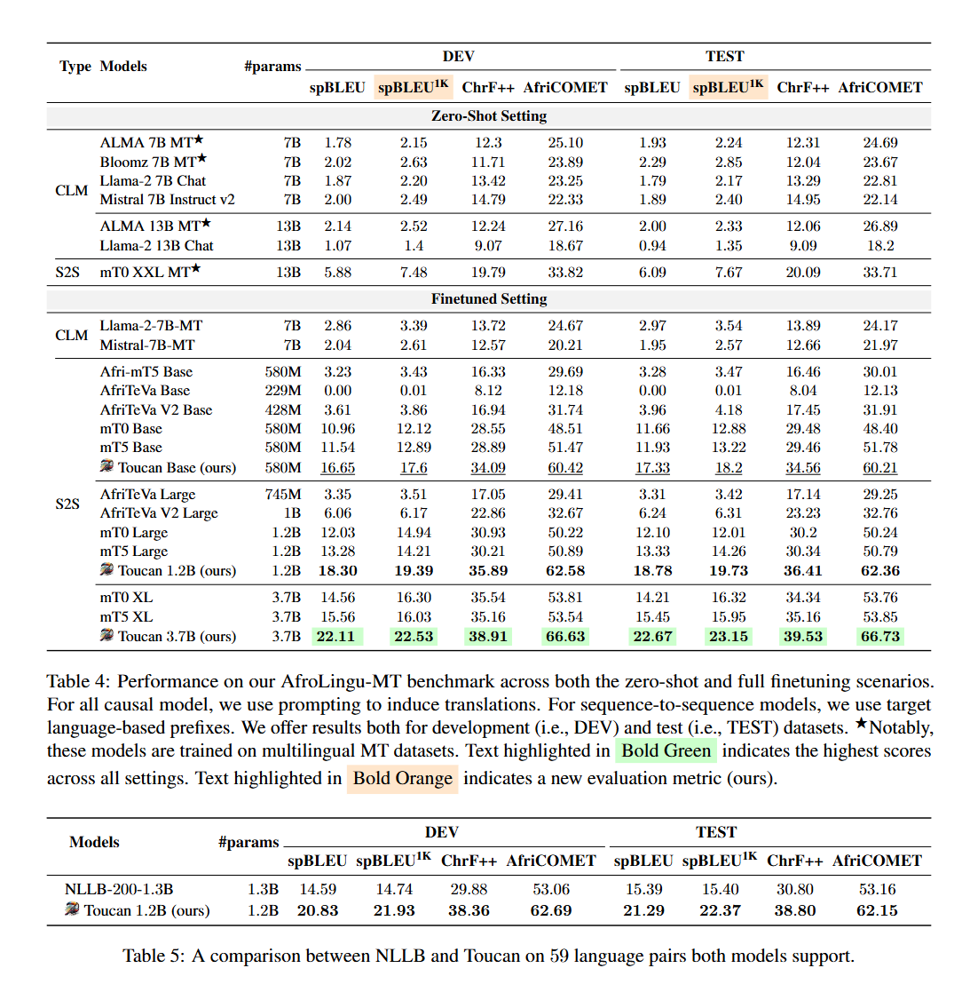
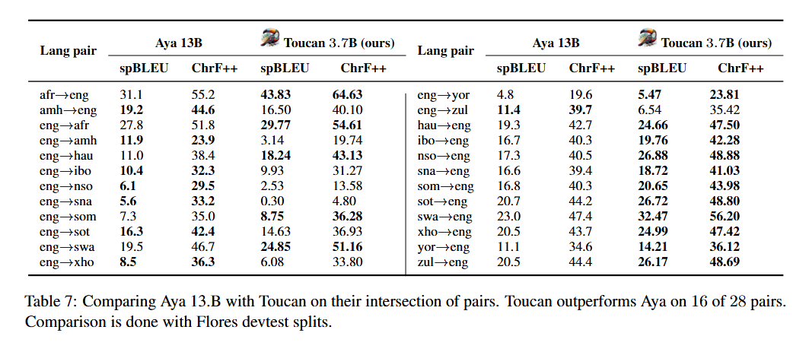

# Toucan

<p align="center">
<a href="https://github.com/UBC-NLP/Toucan/stargazers"></a>
<a href="https://github.com/UBC-NLP/Toucan/network"></a>

</p>
 


<div style='text-align: justify;'>

  
This is the repository accompanying our ACL 2024 paper [Toucan: Many-to-Many Translation for 150 African Language Pairs](https://aclanthology.org/2024.findings-acl.781/). 
We address a notable gap in Natural Language Processing (NLP) by introducing a collection of resources designed to improve Machine Translation (MT) for low-resource languages, with a specific focus on African languages. Our contributions are as follows:
1. We introduce two language models (LMs), Cheetah-1.2B and Cheetah-3.7B, with 1.2 billion and 3.7 billion parameters respectively. 
2. We finetune the aforementioned models to create Toucan, an Afrocentric machine translation model designed to support 156 African language pairs.
3. To evaluate Toucan, we carefully develop an extensive machine translation benchmark, dubbed AfroLingu-MT, tailored for evaluating machine translation. Toucan significantly outperforms other models, showcasing its remarkable performance on MT for African languages.
4. Finally, we train a new model, spBLEU_1K, to enhance translation evaluation metrics, covering 1K languages, including 614 African languages. This work aims to advance the field of NLP, fostering cross-cultural understanding and knowledge exchange, particularly in regions with limited language resources such as Africa. 

</div>

## Our Language Models
To effectively train a MT language model for African languages, it is crucial to start with a powerful, Afrocentric pretrained language model. For this purpose, we select Cheetah (Adebara et al.,
2024), a recently introduced SoTA model with extensive coverage encompassing 517 African languages. One limitation of Cheetah, however, is that it is available only in a base architecture, featuring
580M parameters. Given our objective to develop a large-scale language model for machine translation capabale of serving 156 directions, this base model does not fully meet our requirements. To address this limitation, we embark on training larger and more expansive Afrocentric sequence-to-sequence models. We focus on two sizes: one model with 1.2B parameters and another with 3.7B parameters. We refer to the new models “Cheetah-1.2B” and “Cheetah-3.7B”, respectively, to reflect their enhanced capabilities and parameter scale. These models represent a significant advancement in our efforts to improve machine
translation for African languages, offering greater capacities in handling the rich linguistic nuances of African languages. Cheetah Pertaining. To train the new Cheetah models, we utilize the same pre-training dataset employed in training the original Cheetah-base model (Adebara et al., 2024). This strategic choice ensures consistency in the foundational data across models, enabling the advanced Cheetah-1.2B and Cheetah-3.7B versions to build upon the rich linguistic diversity captured in the original dataset. We refer to (Adebara et al., 2024) for more information about the pretraining data of Cheetah models. We employ a learning rate of 0.01, a batch size of 1, 024 sequences, and a maximum sequence length of 1, 024. Each model undergoes pretraining for 1 million steps. The training process is conducted on Google Cloud TPU with 128 cores (v3 − 128) provided by the TensorFlow Research Cloud (TFRC).

More details about Cheetah's pretraning data, visit Cheetah's GitHub [**Cheetah paper GitHub**](https://github.com/UBC-NLP/Cheetah)


| **Cheetah Models**   | **Link** | 
|---------|:------------------:|    
| 🔥**Cheetah-base**🔥|     [https://huggingface.co/UBC-NLP/cheetah-base](https://huggingface.co/UBC-NLP/cheetah-base) 
| 🔥**Cheetah-1.2B**🔥|     [https://huggingface.co/UBC-NLP/cheetah-1.2B](https://huggingface.co/UBC-NLP/cheetah-1.2B)   


## AfroLingu-MT Benchmark
 
Our collection comprises data from a total of 43 datasets, encompassing 84 unique language pairs derived from 46 different languages. We also develop a new manually translated dataset useful for evaluation in the government domain. In all, the data cover 43 African languages from five language families domiciled in 29 African countries. We also include Arabic, English, and French, since these are widely spoken in Africa. Table 2 shows the different datasets that AfroLingu-MT consists of. 

<div align="center">
 


</div>

| **Benchmark**   | **Link** | 
|---------|:------------------:|    
| 🔥**AfroLingu-MT Benchmark**🔥|     [https://huggingface.co/datasets/UBC-NLP/AfroLingu-MT](https://huggingface.co/datasets/UBC-NLP/AfroLingu-MT)


## MT Models
To create Toucan models, we finetune the Cheetah models on our AfroLingu-MT Benchmark.

| **Tocan Models**   | **Link** | 
|---------|:------------------:|    
| 🔥**Toucan-base**🔥|     [https://huggingface.co/UBC-NLP/toucan-base](https://huggingface.co/UBC-NLP/toucan-base) 
| 🔥**Toucan-1.2B**🔥|     [https://huggingface.co/UBC-NLP/toucan-1.2B](https://huggingface.co/UBC-NLP/toucan-1.2B)   
 

## spBLEU<sup>1K</sup> Metric

spBLEU metric covers merely 23 out of the 43 languages present in our AfroLingu-MT benchmark. To address this limitation, we adopt a methodology similar to that of Goyal et al. (2022). Namely, we develop a new SentencePiece tokenizer that utilizes 1000+ monolingual data sources. We collect monolingual data covering 1,003 languages, including 614 African languages, 53 Indigenous American languages, and the remainder spanning the most resource-rich languages world-wide. 

- More details about spBLEU<sup>1K</sup> traning data and usage, [click here](https://github.com/UBC-NLP/Toucan/tree/main/spBLEU-1K)

## Results
we present the performance outcomes of our proposed models as well as the baseline models each evaluated independently on the AfroLingu-MT benchmark. This evaluation employs three pertinent metrics specific to machine translation. These metrics are: spBLEU_1K, SentencePiece BLEU (i.e., spBLEU) (Goyal et al., 2022), word-based Character n-gram F-score (i.e., ChrF++) (Popovi ́c, 2015b), and AfriCOMET (Wang et al., 2023). These metrics have been selected for their effectiveness in assessing the quality of machine translations from various perspectives, including lexical accuracy and fluency. 

Additionally, we compare our model, Toucan-1.2B, to the Facebook’s NLLB model (Team et al.,2022; Costa-jussà et al., 2022). Again, we find Toucan-1.2B outperforming NLLB-200-1.3B by 6.96 points in spBLEU<sup>1K</sup>, as shown in Table 5.

<div align="center">
  
</div>


We compare the performance of Toucan with Aya (Üstün et al., 2024). We use results for Aya as they appear in the paper, hence, we do not compute spBLEU1k results in this analysis. Although Aya is a 13B parameter model, significantly larger than Toucan 3.7B, we report better performance in 16 of 28 pairs.

<div align="center">

</div>

##  How to use Cheetah-1.2B model

Below is an example for using **Cheetah-1.2B** predict masked tokens. 
``` bash
from transformers import T5Tokenizer, AutoModelForSeq2SeqLM

tokenizer = T5Tokenizer.from_pretrained("UBC-NLP/cheetah-1.2B")
model = AutoModelForSeq2SeqLM.from_pretrained("UBC-NLP/cheetah-1.2B")

yor_prompt="ìròyìn kan nípa owó ìjọba <extra_id_0> kan"

input_ids = tokenizer(yor_prompt, return_tensors="pt").input_ids
outputs = model.generate(input_ids)
print("Cheetah-1.2B - Tokenized input:", tokenizer.tokenize(yor_prompt))
print("Cheetah-1.2B - Decoded output:", tokenizer.decode(outputs[0], skip_special_tokens=True))

```
Output:
```bash
Cheetah-1.2B - Tokenized input: ['▁ìròyìn', '▁kan', '▁nípa', '▁owó', '▁ìjọba', '<extra_id_0>', '▁kan']
Cheetah-1.2B - Decoded output: Nàìjíríà
```

##  How to use Toucan model
To translate using Toucan models, use the target language ISO-3 code as preix. Below the supported langauges
```
lang_names={
    "aar": "Afar",
    "ach": "Acholi",
    "afr": "Afrikaans",
    "aka": "Akan",
    "amh": "Amharic",
    "bam": "Bambara",
    "bas": "Basaa",
    "bem": "Bemba",
    "btg": "Bete Gagnoa",
    "eng": "English",
    "ewe": "Ewe",
    "fon": "Fon",
    "fra": "French",
    "hau": "Hausa",
    "ibo": "Igbo",
    "kbp": "Kabiye",
    "lgg": "Lugbara",
    "lug": "Luganda",
    "mlg": "Malagasy",
    "nyn": "Nyakore",
    "orm": "Oromo",
    "som": "Somali",
    "sot": "Sesotho",
    "swa": "Swahili",
    "tir": "Tigrinya",
    "yor": "Yoruba",
    "teo": "Ateso",
    "gez": "Geez",
    "wal": "Wolaytta",
    "fan": "Fang",
    "kau": "Kanuri",
    "kin": "Kinyawanda",
    "kon": "Kongo",
    "lin": "Lingala",
    "nya": "Chichewa",
    "pcm": "Nigerian Pidgin",
    "ssw": "Siswati",
    "tsn": "Setswana",
    "tso": "Tsonga",
    "twi": "Twi",
    "wol": "Wolof",
    "xho": "Xhosa",
    "zul": "Zulu",
    "nnb": "Nande",
    "swc": "Swahili Congo",
    "ara": "Arabic"
}
```
Below is an example for translating using **Toucan-1.2B**. 
``` bash
from transformers import AutoTokenizer, MT5ForConditionalGeneration
import torch
tokenizer = AutoTokenizer.from_pretrained("UBC-NLP/toucan-1.2B")
model = MT5ForConditionalGeneration.from_pretrained("UBC-NLP/toucan-1.2B", torch_dtype=torch.float16, device_map="auto")
model.eval()

#Translate from Enlglish to Zulu
text="zul: Clear all items from the recent documents list"
input_ids = tokenizer(text, return_tensors="pt", max_length=1024, truncation=True).to("cuda:0")
with torch.no_grad():
    generated_ids = model.generate(**input_ids, num_beams=5, max_new_tokens=len(text), do_sample=True, temperature=0.6, top_p=0.9)
print("Toucan-1.2B - translation:", tokenizer.batch_decode(generated_ids, skip_special_tokens=True,  skip_prompt=True)[0])

```
Output:
```bash
Toucan-1.2B - translation: Susa zonke izinto kuhlu lwamadokhumende oludlule
```
     
## Supported languages
Please refer to [**supported-languages**](https://github.com/UBC-NLP/Toucan/blob/main/supported-languages.txt)

More details about Cheetah's pretraning data, visit Cheetah's GitHub [**Cheetah paper GitHub**](https://github.com/UBC-NLP/Cheetah)

## Citation
If you use the pre-trained model (Cheetah-1.2B) for your scientific publication, or if you find the resources in this repository useful, please cite our papers as follows:

**Toucan's Paper**
```
@inproceedings{elmadany-etal-2024-toucan,
    title = "Toucan: Many-to-Many Translation for 150 African Language Pairs",
    author = "Elmadany, AbdelRahim  and
      Adebara, Ife  and
      Abdul-Mageed, Muhammad",
    editor = "Ku, Lun-Wei  and
      Martins, Andre  and
      Srikumar, Vivek",
    booktitle = "Findings of the Association for Computational Linguistics ACL 2024",
    month = aug,
    year = "2024",
    address = "Bangkok, Thailand and virtual meeting",
    publisher = "Association for Computational Linguistics",
    url = "https://aclanthology.org/2024.findings-acl.781",
    pages = "13189--13206",
}
```

**Cheetah's Paper** 
```
@inproceedings{adebara-etal-2024-cheetah,
    title = "Cheetah: Natural Language Generation for 517 {A}frican Languages",
    author = "Adebara, Ife  and
      Elmadany, AbdelRahim  and
      Abdul-Mageed, Muhammad",
    editor = "Ku, Lun-Wei  and
      Martins, Andre  and
      Srikumar, Vivek",
    booktitle = "Proceedings of the 62nd Annual Meeting of the Association for Computational Linguistics (Volume 1: Long Papers)",
    month = aug,
    year = "2024",
    address = "Bangkok, Thailand and virtual meeting",
    publisher = "Association for Computational Linguistics",
    url = "https://aclanthology.org/2024.acl-long.691",
    pages = "12798--12823",
}
```

## Acknowledgments
We gratefully acknowledges support from Canada Research Chairs (CRC), the Natural Sciences and Engineering Research Council of Canada (NSERC; RGPIN-2018-04267), the Social Sciences and Humanities Research Council of Canada (SSHRC; 435-2018-0576; 895-2020-1004; 895-2021-1008), Canadian Foundation for Innovation (CFI; 37771), [Digital Research Alliance of Canada](https://alliancecan.ca), [UBC ARC-Sockeye](https://arc.ubc.ca/ubc-arc-sockeye), Advanced Micro Devices, Inc. (AMD), and Google. Any opinions, conclusions or recommendations expressed in this material are those of the author(s) and do not necessarily reflect the views of CRC, NSERC, SSHRC, CFI, the Alliance, AMD, Google, or UBC ARC-Sockeye.
